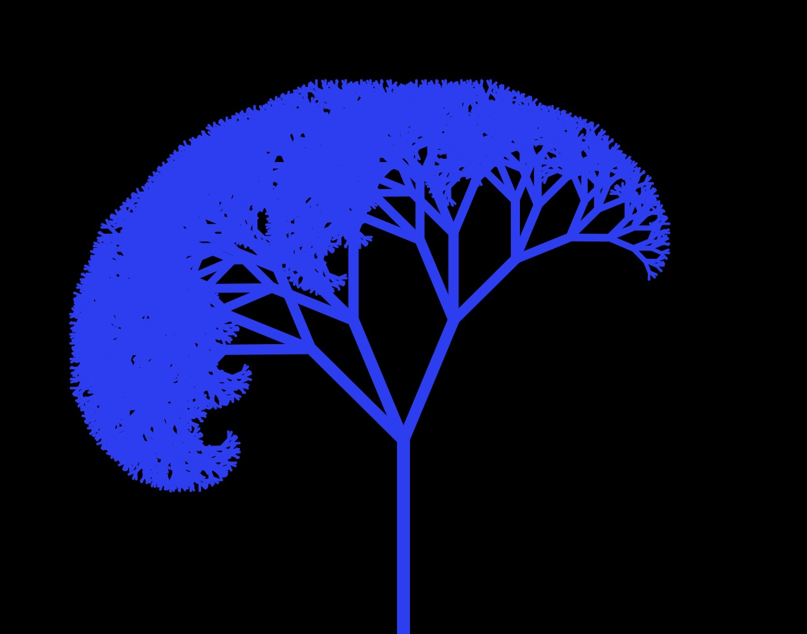
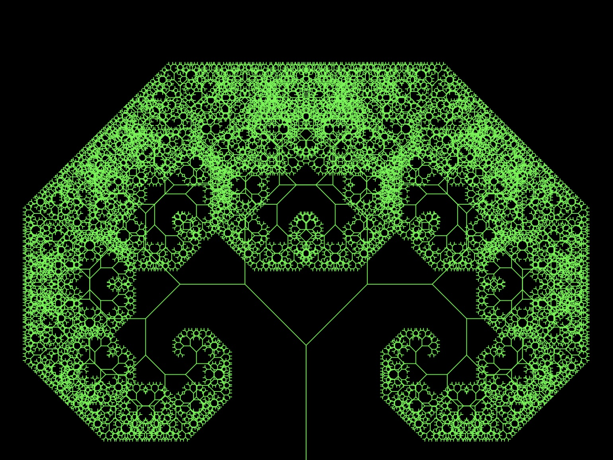

# Fun with Fractals

#### Supplement to the article published by Better Programming, [Learning p5.js by Making Fractals](https://medium.com/better-programming/learning-p5-js-by-making-fractals-cbdcac5c651e)

Create Fractals using P5.JS, JavaScript and recursive logic. 

A slider allows the user to dynamically redraw the tree with different angles of branching.

